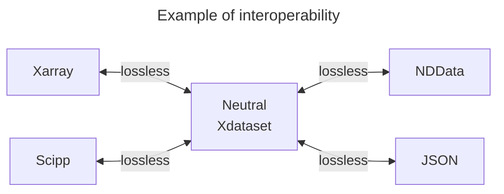

### *NTV-NumPy : A multidimensional semantic, compact and reversible format for interoperability*

For more information, see the [user guide](https://loco-philippe.github.io/ntv-numpy/docs/user_guide.html) or the [github repository](https://github.com/loco-philippe/ntv-numpy).


# Why a new format for multidimensional data ?

Chaque outil a une structure spécifique pour traiter les données multidimensionnelles avec pour conséquences:

- des interfaces dédiés à chaque outil,
- des données traitées partiellement,
- pas de représentation unifiée des structures de données

The proposed format (NTVmulti) is based on the following principles:

- neutral format available for tabular or multidimensional tools (e.g. Numpy, pandas, xarray, scipp, astropy),
- taking into account a wide variety of data types as defined in [NTV](https://www.ietf.org/archive/id/draft-thomy-json-ntv-02.html) format,
- high interoperability: reversible (lossless round-trip) interface with tabular or multidimensional tools,
- reversible and compact JSON format (including categorical and sparse format),
- Ease of sharing and exchanging multidimensional and tabular data,

## main features

The NTV-Numpy converter uses the NTVmulti format pour:

- fournir des interfaces lossless et reversible avec les principaux outils de traitement des données multidimensionnelles et tabulaires,
- offrir des solutions d'échange et de partage de données avec des formats neutres ou banalisés (e.g. JSON, Numpy).

NTV-NumPy was developped originally in the [json-NTV project](https://github.com/loco-philippe/NTV)

## example

In the example below, a dataset available in JSON is shared with scipp or Xarray.



### Data example

```python
In [1]: example = {
                'example:xdataset': {
                        'var1': [['float[kg]', [2, 2], [10.1, 0.4, 3.4, 8.2]], ['x', 'y']],
                        'var1.variance': [[[2, 2], [0.1, 0.2, 0.3, 0.4]]],
                        'var1.mask1': [[[True, False]], ['x']],
                        'var1.mask2': [[[2, 2], [True, False, False, True]]],
                
                        'var2': [['var2.ntv'], ['x', 'y']],    
                        
                        'x': [['string', ['23F0AE', '578B98']], {'test': 21}],
                        'y': [['date', ['2021-01-01', '2022-02-02']]],
                        
                        'ranking': [['month', [2, 2], [1, 2, 3, 4]], ['var1']],
                        'z': [['float', [10, 20]], ['x']],
                        'z.uncertainty': [[[0.1, 0.2]]],
                        
                        'z_bis': [[['z1_bis', 'z2_bis']]],
                
                        'info': {'path': 'https://github.com/loco-philippe/ntv-numpy/tree/main/example/'}
                }
        }

In [2]: from ntv_numpy import Xdataset

        x_example = Xdataset.read_json(example)
        x_example.info
Out[2]: 
```

The JSON representation is equivalent to the Xdataset entity (Json conversion reversible)

```python
In [3]: x_json = x_example.to_json()
        x_example_json = Xdataset.read_json(x_json)
        x_example_json == x_example
Out[2]: True
```

### Xarray interoperability

```python
In [4]: x_xarray = x_example.to_xarray()
        x_xarray
Out[4]: xxxx
```

Reversibility:

```python
In [3]: x_example_xr = Xdataset.from_xarray(x_xarray)
        x_example_xr == x_example_json == x_example
Out[2]: True
```

### scipp interoperability

```python
In [4]: x_scipp = x_example.to_scipp()
        print(x_scipp['example'])
Out[4]: xxxx
```

Reversibility:

```python
In [3]: x_example_sc = Xdataset.from_scipp(x_scipp)
        x_example_sc == x_example_xr == x_example_json == x_example
Out[2]: True
```

### NDData interoperability

```python
In [1]: example = {
                'example:xdataset': {
                        'data': [['float[erg/s]', [1,2,3,4]]],
                        'data.mask': [[[False, False, True, True]]],
                        'data.uncertainty': [['float64[std]', [1.0, 1.414, 1.732, 2.0]]],
                        'meta': {'object': 'fictional data.'},
                        'wcs':  {'WCSAXES': 2, 'CRPIX1': 2048.0, 'CRPIX2': 1024.0, 'PC1_1': 1.2905625619716e-05,
                                'PC1_2': 5.9530912331034e-06, 'PC2_1': 5.0220581265601e-06, 'PC2_2': -1.2644774105568e-05,
                                'CDELT1': 1.0, 'CDELT2': 1.0, 'CUNIT1': 'deg', 'CUNIT2': 'deg', 'CTYPE1': 'RA---TAN',
                                'CTYPE2': 'DEC--TAN', 'CRVAL1': 5.63056810618, 'CRVAL2': -72.05457184279, 'LONPOLE': 180.0,
                                'LATPOLE': -72.05457184279, 'WCSNAME': 'IDC_qbu1641sj', 'MJDREF': 0.0, 'RADESYS': 'ICRS'},
                        'psf': [['float[erg/s]', [1,2,3,4]]]
                }
        } 
        n_example = Xdataset.read_json(example)
        n_example.info 
Out[4]: xxxx
```

Reversibility:

```python
In [5]: n_example_ndd = Xdataset.from_nddata(n_nddata)
        n_example_ndd == n_example
Out[5]: True

In [6]: print(npd.read_json(df_to_json).equals(df))
Out[6]: True
```

## URI usage

In the example, only structural data is exchanged with json format.

```python
In [1]: example = {
                'example:xdataset': {
                        'var1': [['float[kg]', [2, 2], 'var1.ntv'], ['x', 'y']],
                        'var1.variance': [[[2, 2], 'var1_variance.ntv']],
                        'var1.mask1': [['var1_mask1.ntv'], ['x']],
                        'var1.mask2': [[[2, 2], 'var1_mask2.ntv']],
                
                        'var2': [['var2.ntv'], ['x', 'y']],    
                        
                        'x': [['x.ntv'], {'test': 21}],
                        'y': [['date', 'y.ntv']],
                        
                        'ranking': [['month', [2, 2], 'ranking.ntv'], ['var1']],
                        'z': [['float', 'z.ntv'], ['x']],
                        'z.uncertainty': [['z_uncertainty.ntv']],
                        
                        'z_bis': [['z_bis.ntv']],
                
                        'info': {'path': 'https://github.com/loco-philippe/ntv-numpy/tree/main/example/'}
                }
        }
```

The complete example can be rebuild with loading data (path + file name).

```python
In [5]: # simulation of reading files at the indicated "path"
        var1          = np.array([10.1, 0.4, 3.4, 8.2])
        var1_variance = Ndarray([0.1, 0.2, 0.3, 0.4], ntv_type='float')
        var1_mask1    = np.array([True, False])
        var1_mask2    = np.array([True, False, False, True])
        var2          = Ndarray('var2.ntv')
        x             = np.array(['23F0AE', '578B98'])
        y             = np.array(['2021-01-01', '2022-02-02'], dtype='datetime64[D]')
        ranking       = np.array([1, 2, 3, 4])
        z             = np.array([10.0, 20.0])
        z_uncertainty = np.array([0.1, 0.2])
        z_bis         = np.array(['z1_bis', 'z2_bis'])

        array_data = [var1, var1_variance, var1_mask1, var1_mask2, var2, x, y, ranking, z, z_uncertainty, z_bis]

        x_example_mixte_numpy = copy(x_example_mixte)
        for data, xnda in zip(array_data, x_example_mixte_numpy.xnd):
        xnda.set_ndarray(Ndarray(data))

        x_example_mixte_numpy == x_example_mixte_json == x_example_sc == x_example_xr == x_example_json == x_example
Out[5]: True
```
